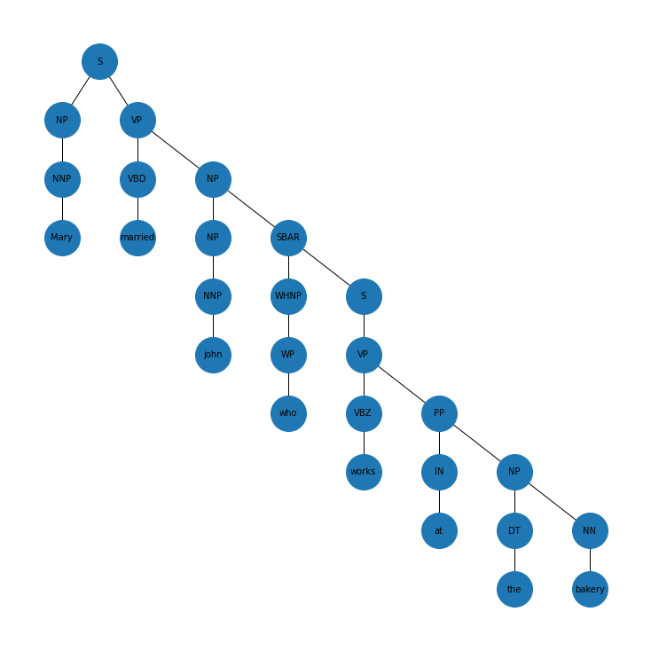

# hMDS: Hyperbolic Multidimensional Scaling
A simple Python implementation for producing hyperbolic embedding using the hMDS algorithm proposed in [Representation Tradeoffs for Hyperbolic Embeddings](https://arxiv.org/pdf/1804.03329.pdf).

Given the oberved pairwise distances arising from a set of points in hyperbolic space, the goal of hMDS is to recover the set of points (hyperbolic embeddings) or some other set of points with the same pairwise distances.


# Usage Example
For hierarchical data, hyperbolic geometry offers an exciting approach to learning low-dimensional embeddings while preserving rich structural information owing to the exponential growth in volume with respect to its radius. Whereas, the growth is only polinomial in Euclidean geometry.

Let us consider the following example: "Mary married john who works at the bakery"
The constituency tree (hierarchical structure) of this sentence is shown bellow

<p align="center">
  
</p>

The following code snippet recovers the hyperbolic embeddings in matrix form $X_{rec} \in R^{n \times r}$ of the sentence words given their pairwise distances in distance matrix $A \in R^{n \times n}$, which represents the shortest paths in the constituency tree.

Note that the dimension of the recovered embeddings $r: r < n$. You can lower the upper bound of the embedding dimension using the parameter ```0 < k <= n``` of the function ```hmds```.

```python
import numpy as np
from hMDS.embedding import hmds, poincare_dist
from hMDS.utils import distortion

# Original distance matrix
A = np.array([
              [0.,  6,  8,  9,  10, 11, 12, 12], 
              [6.,  0,  6,  7,  8,  9,  10, 10],
              [8.,  6,  0,  7,  8,  9,  10, 10],
              [9.,  7,  7,  0,  7,  8,  9,  9],
              [10,  8,  8,  7,  0,  5,  6,  6],
              [11,  9,  9,  8,  5,  0,  5,  5],
              [12, 10, 10,  9,  6,  5,  0,  4],
              [12, 10, 10,  9,  6,  5,  4,  0],
            ])
# Run hMDS
scale = 1
Xrec = hmds(A, k=8, scale=scale)

print(f">> Embeddings in the Poincaré Ball of dimension r = {Xrec.shape[1]}")

# Compute the reconstructed distance matrix
n = A.shape[0]
Hrec = np.zeros_like(A)
for i in range(n):
    for j in range(n):
        Hrec[i,j] = poincare_dist(Xrec[i], Xrec[j])/scale

print(">> Recovered pairwise distances:")
print(np.round(Hrec, 2))

# Evaluate the distortion
dist = distortion(A, Hrec, n=8)
print(f'>> Average distortion = {np.round(dist["avg_distortion"], 2)}, best average distortion is 0.')
print(f'>> Worst-case distortion = {np.round(dist["wc_distortion"], 2)}, best worst-case distortion is 1.')
```

# Aknowledgement
Code modified from the julia implementation of hMDS in [hyperbolics](https://github.com/HazyResearch/hyperbolics)